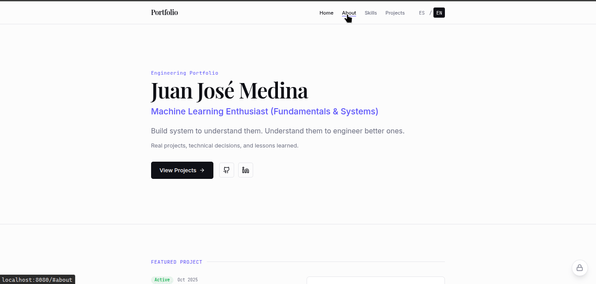

# 💼 Portfolio

Personal portfolio website showcasing software engineering projects.

## Overview

This is a modern, responsive portfolio built with React and TypeScript. It features secure admin authentication using TOTP (Time-based One-Time Passwords) for managing project content dynamically.



## 🛠️ Tech Stack

- **Frontend**: React 18, TypeScript
- **Build Tool**: Vite
- **UI Framework**: Tailwind CSS, shadcn/ui components
- **Routing**: React Router v6
- **Authentication**: otplib (TOTP), qrcode
- **Markdown**: react-markdown with @tailwindcss/typography
- **State Management**: React Query
- **Testing**: Vitest, React Testing Library

## ✨ Features

- Responsive design optimized for all devices
- Internationalization support (English/Spanish)
- Dynamic project management with admin panel
- Secure two-factor authentication using Microsoft Authenticator
- Markdown support for project descriptions
- Dark mode support via next-themes
- SEO optimized

## Getting Started

### Prerequisites

- Node.js 18+
- npm or bun

### 📦 Installation

1. Clone the repository

```bash
git clone <your-repo-url>
cd ml-portfolio
```

2. Install dependencies

```bash
npm install
```

3. Create environment variables

```bash
# Linux/MacOS
touch .env

# Windows Powershell
New-Item .env
```

Edit `.env` and add your pssw hashed:

- `VITE_ADMIN_PASSWORD_HASH`: Your password hashed

4. Start development server

```bash
# Run server
npm run dev

> ml-portfolio@1.0.0 dev
> vite


  VITE v7.3.1  ready in 748 ms

  ➜  Local:   http://localhost:8080/
  ➜  Network: http://192.164.29.114:8080/
  ➜  press h + enter to show help
```

## </> Available Scripts

- `npm run dev` - Start development server
- `npm run build` - Build for production
- `npm run build:dev` - Build in development mode
- `npm run preview` - Preview production build
- `npm run lint` - Run ESLint
- `npm run test` - Run tests
- `npm run test:watch` - Run tests in watch mode

## 🏗️ Project Structure

**[Complete structure](./structure.md)**

```
src/
├── components/       # React components
│   ├── home/        # Home page sections
│   ├── layout/      # Layout components (Header, Footer)
│   ├── projects/    # Project-related components
│   └── ui/          # shadcn/ui components
├── contexts/        # React contexts (Auth, Language)
├── hooks/           # Custom React hooks
├── lib/             # Utilities and data
│   ├── profile.ts   # Profile information
│   ├── projects.ts  # Projects data and CRUD
│   └── utils.ts     # Helper functions
├── pages/           # Route pages
└── App.tsx          # Main application component
```

## Admin Features

The portfolio includes a secure admin panel for managing projects:

1. Click the lock icon in the bottom-right corner
2. First-time setup: Enter setup password to view QR code
3. Scan QR code with Microsoft Authenticator
4. Login with 6-digit TOTP code
5. Add, edit, or delete projects

## 🔒 Security

- TOTP-based two-factor authentication
- Environment variables for sensitive data
- Setup password protection for QR code access
- No secrets committed to repository

## 🌐 Deployment

### Build

```bash
npm run build
```

The build output will be in the `dist/` directory.

### Environment Variables

When deploying, make sure to set these environment variables in your hosting platform.
You must generate it from this website: https://emn178.github.io/online-tools/sha256.html

- `VITE_ADMIN_PASSWORD_HASH`

### Recommended Platforms

- Vercel
- Netlify
- GitHub Pages
- Cloudflare Pages

## 🧪 Testing

Run the test suite:

```bash
npm test
```

Run tests in watch mode during development:

```bash
npm run test:watch
```

## 📄 License

This project is under the MIT License. See the [LICENCE](./LICENCE) file for more details.

MIT License Summary:

Free software to use, copy, modify, merge, publish, distribute
Can be used for commercial purposes
License includes original copyright
No warranty and authors are not responsible for damages

## 👤 Author

Juan José Medina  
Email: josepemlengineer@gmail.com  
GitHub: [@JOSE-MDG](https://github.com/JOSE-MDG)

## Acknowledgments

- UI components from [shadcn/ui](https://ui.shadcn.com/)
- Icons from [Lucide](https://lucide.dev/)
- Built with [Vite](https://vitejs.dev/)
